# GreddIIT, the clone of Reddit (but better)

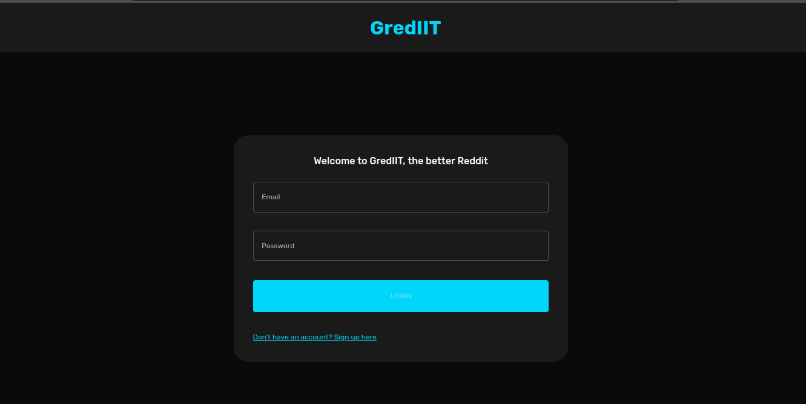
<br><br><br>

## **Running the App**

---

Clone the github repository onto your local machine, either by using `git clone` or by directly downloading the zip

<br>

> If, on Linux you can run the script attached to start the whole application using the following command

    bash ./run.sh

<br>

> To run the processes individually

- To run the backend
  ```
  cd server
  npm install && nodemon index.js
  ```
- To run the frontend
  ```
  cd client
  npm install && npm start -y
  ```

> To run the docker file

    sudo docker-compose build
    sudo docker-compose up

<br>

## **Description**

---

GredIIT is a social media platform based on MERN stack with UI designed using MUI. It resembled to the original Reddit in a lot of aspects.

All the data is being stored in MongoDB cloud. To attach your `MongoDB URI`, change the URI in the backend folder .env to your own URI.

Some features of the application are listed below

- **Light and Dark mode** (the colors are defined in theme.js in frontend folder)

    <br>
    <center>
    
    
    <br>--

    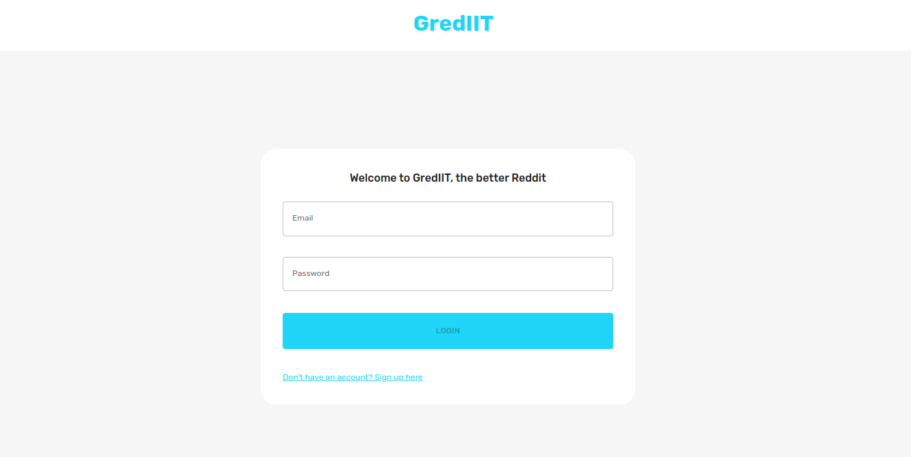
    </center>

    <br>

- **Register page** (the password is encrypted before storing in the database)

    <br>
    <center>
        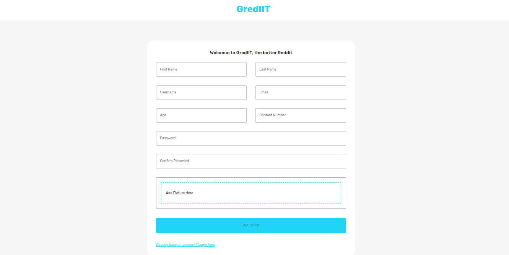
    </center>

    <br>

- **Login Page** (a token along with some basic details of the user are stored in the local using Redux which thus allow to access the site, even on closing the tab/browser/PC, until logged out)

- **Home Page** : The home page consists of "subgrediits" which are similar to the concept of subreddits in Reddit.

  - You can create your own subgrediit OR

  - You can request to join someone else's subgrediit

  - You can sort the arrangement of the subgrediit based on name, number of followers and the creation date. ( Without any filters, the joined subgrediits are shown first followed by the un-joined subgrediits)

  - A search bar having fuzzy search based on the name of the subgrediits and the tags associated with them.

  - For subgrediits you have the following options

    - **Delete** : Appears only if you have created the subgrediit
    - **Join** : If someone else has created the subgrediit, and you want to join the subgrediit, in order to see and create posts inside the subgrediit
    - **Leave** : If you have already joined the subgrediit and want to leave the subgrediit

      > If you leave the subgrediit once, you won't be able to join it again

    - **Blocked** : If you created a post, which was reported by someone and the moderator of that subgrediit blocked you, in that case you won't be able to access the subgrediit

        <br>
        <center>
        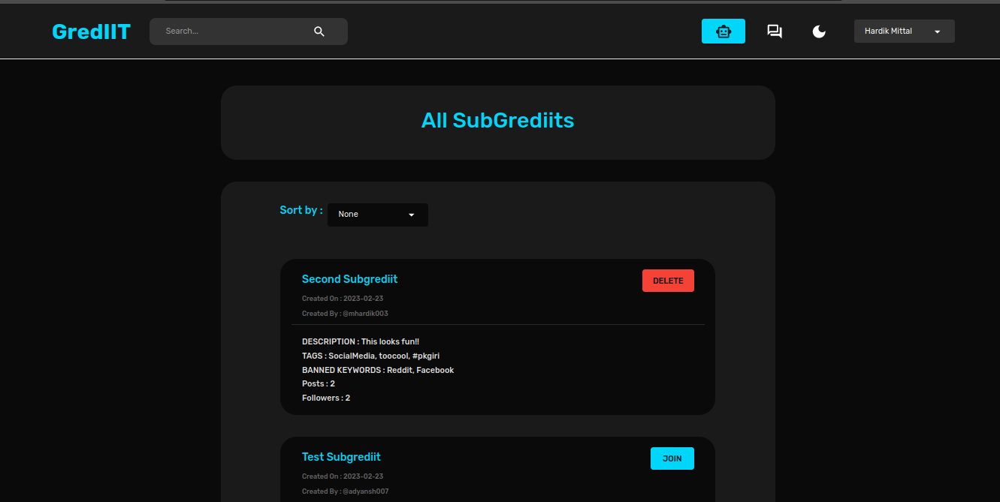
        
        <br>-
        
        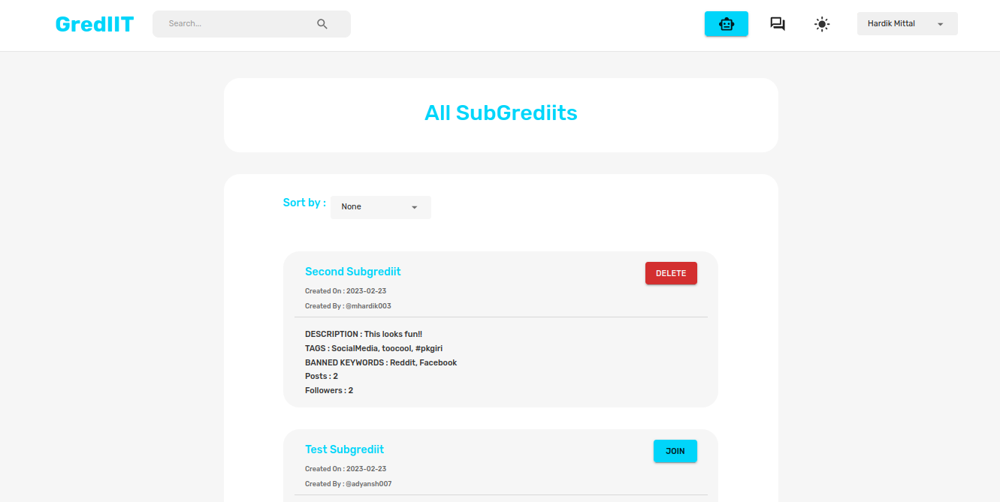
        </center>

    <br>

- **Posts** : On clicking a subgrediit on the home page, you are redirected to this page where the posts can be created.

  > If the post title contains the banned keywords of that subgrediit, then you cannot create that post. But if the description has banned keywords, they will be converted to asterisks after notifying the user

  - Posts have the following features :

    - Upvoting of the posts (one user can upvote a post only once)
    - Downvoting of the posts (same)
    - Comments (Are a bit broken)
    - Follow the user who created the post
    - Saving of the posts for later ( can be accessed from the `Saved Posts ` menu in the dropdown)
    - Reporting of the posts

    <br>
      <center>
      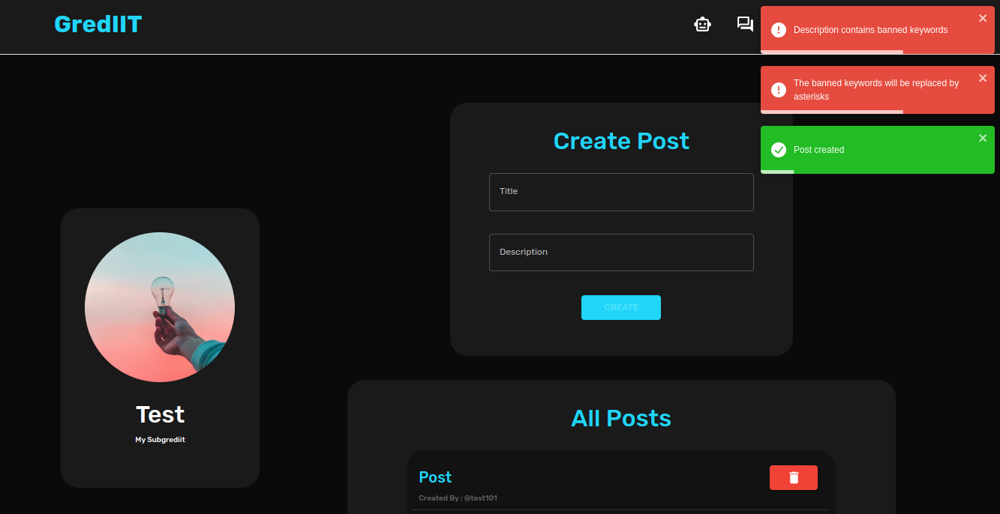
      <br>-
      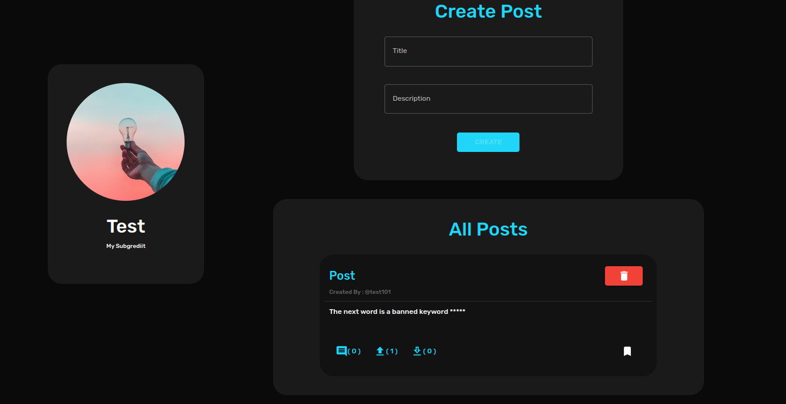
      </center>
    <br>
<br>

- **Chats** : Only the basic UI has been implemented. They do not work as of now.

- **Profile Page**

  - Shows the details of the user

    - Here you can also the see the following 2 options

      - **Followers** : The people who follow you : You can remove them

      - **Following** : The people whom you follow : You can remove the previous following and add more following as well

  - Gives a form to change the details of the user (except the email id and the password of the user)

    <br>
    <center>
    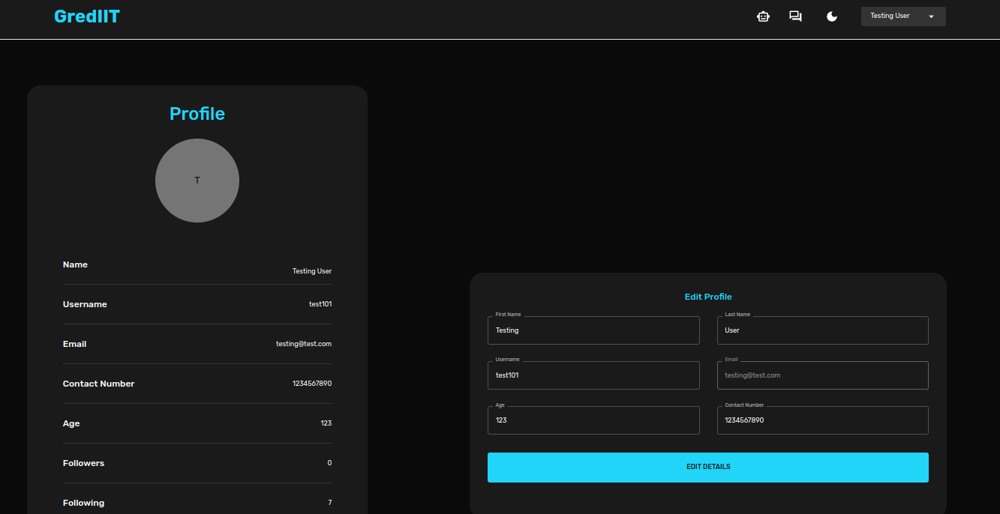
    <br>-
    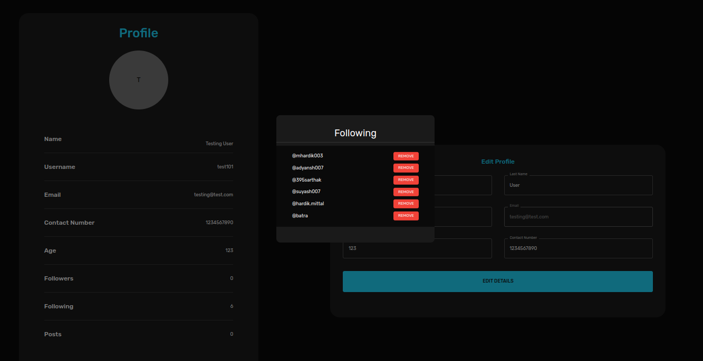
    </center>
<br>

- **My Subgrediits** : Shows the subgrediits created by you. You can see the basic details about that subgrediit along with the option of deleting the subgrediit

    <br>
    <center>
    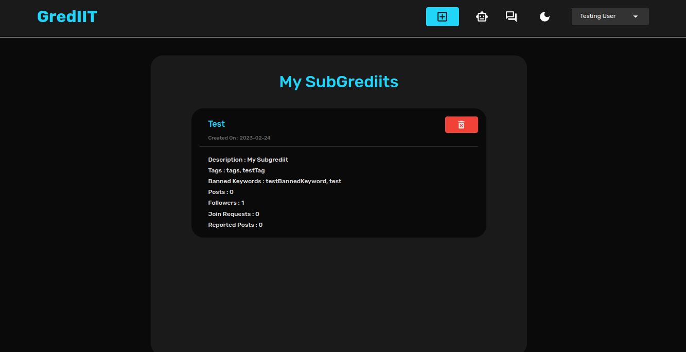
    </center>
    <br>
    
    * On clicking the subgrediit, you go to next page, which gives a description of that subgrediit along with 4 options at the top
        * **Users** : shows the followers and the blocked users of that subgrediit
        * **Joining Requests** : shows the list of joining requests for that subgrediit
        * **Reports** : shows all the reports for the posts present in that subgrediit
        * **Stats** : shows some basics stats about that subgrediit (has not been implemented properly)

    <br>
    <center>
    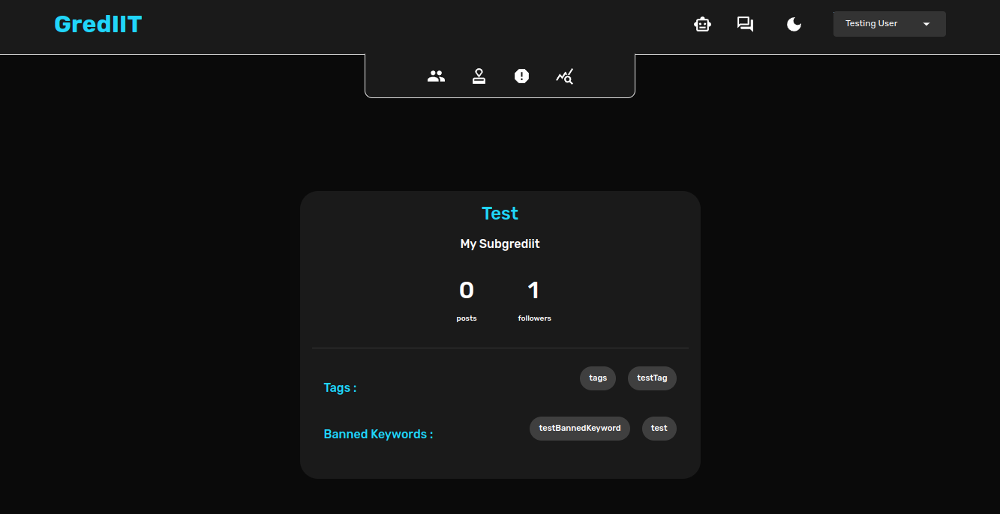
    </center>
    <br>

- **Saved Posts** : Shows the posts saved by the user

    <br>
    <center>
    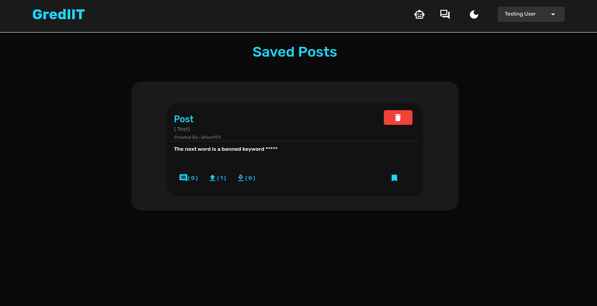

    </center>
    <br>


---

<br>

> Refer to **`details.pdf`** for further details (the highlighted features are the ones that have been implemented) and feel free to commit for any bugs